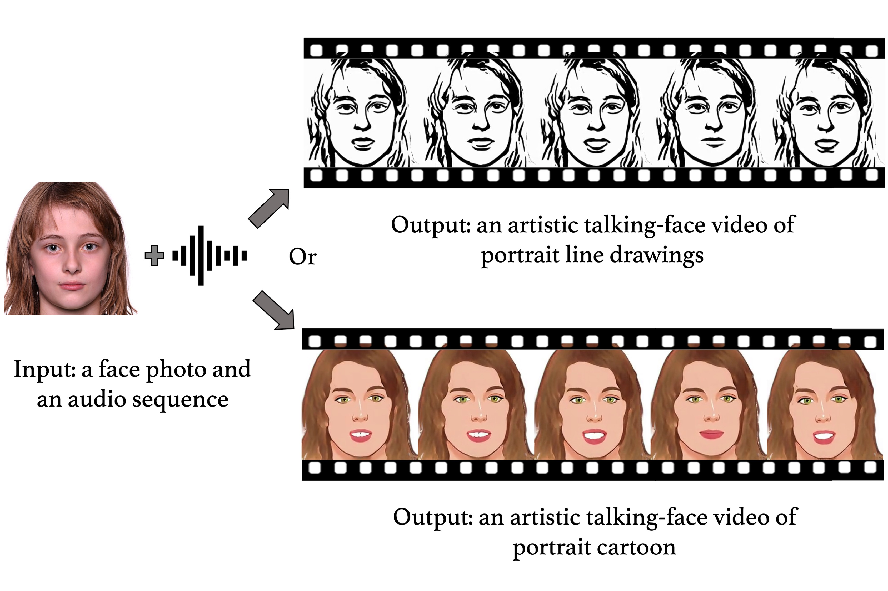

## Code for "Animating Portrait Line Drawings from a Single Face Photo and a Speech Signal" (SIGGRAPH 22 conference proceedings)

The program takes a face photo and a speech signal as inputs, and outputs an artistic talking video of portrait line drawings or portrait cartoon.

<video src='https://user-images.githubusercontent.com/16771200/180014736-b604ba55-c51b-40e7-bb49-91a3c1c3e80c.mp4'></video>

[[paper]](https://drive.google.com/file/d/14HOmhHQlcr-x2yRh_S7b-j6CZ2mmDt1E/view?usp=sharing)

> **Animating Portrait Line Drawings from a Single Face Photo and a Speech Signal**
>
> [Ran Yi](https://yiranran.github.io)
> [Zipeng Ye](https://qq775793759.github.io)
> [Ruoyu Fan]()
> [Yezhi Shu](https://scholar.google.com/citations?user=ItEyqMAAAAAJ&hl=en)
> [Yong-Jin Liu](https://cg.cs.tsinghua.edu.cn/people/~Yongjin/Yongjin.htm)
> [Yu-Kun Lai](https://users.cs.cf.ac.uk/Yukun.Lai/)
> [Paul Rosin](https://users.cs.cf.ac.uk/Paul.Rosin/)
> 
> SIGGRAPH 2022
>
> **Abstract** Animating a single face photo is an important research topic which receives considerable attention in computer vision and graphics. Yet line drawings for face portraits, which is a longstanding and popular art form, have not been explored much in this area. Simply concatenating a realistic talking face video generation model with a photo-to-drawing style transfer module suffers from severe inter-frame discontinuity issues. To address this new challenge, we propose a novel framework to generate artistic talking portrait-line-drawing video, given a single face photo and a speech signal. After predicting facial landmark movements from the input speech signal, we propose a novel GAN model to simultaneously handle domain transfer (from photo to drawing) and facial geometry change (according to the predicted facial landmarks). To address the inter-frame discontinuity issues, we propose two novel temporal coherence losses: one based on warping and the other based on a temporal coherence discriminator. Experiments show that our model produces high quality artistic talking portrait-line-drawing videos and outperforms baseline methods. We also show our method can be easily extended to other artistic styles and generate good results. The source code is available at https://github.com/AnimatePortrait/AnimatePortrait.
>



### Prerequisites
- Linux
- Python 3
- NVIDIA GPU + CUDA CuDNN


### Environment
Install PyTorch and dependencies by:
```bash
conda create -n animeportrait python=3.6
pip install -r requirements
pip install torch==1.8.2+cu111 torchvision==0.9.2+cu111 torchaudio==0.8.2 -f https://download.pytorch.org/whl/lts/1.8/torch_lts.html
```


### Quick Test
1. Download pretrained models from here: 
- [Module1_checkpoints](https://drive.google.com/file/d/1T3-umTjpDh2FYCTGqjJRfk1_DgEP-Do_/view?usp=sharing), unzip by "tar xf" and put the folder to `Module1/checkpoints`;
- [Module2_checkpoints](https://drive.google.com/file/d/1c_vXDrjFV-G_6wCRFAaxIPcfe200i4X1/view?usp=sharing), unzip by "tar xf" and put the folder to `Module2/checkpoints`

2. Run commands below to generate artistic talking videos of line drawing and cartoon:
```bash
# for line drawing
CUDA_VISIBLE_DEVICES=0 python main_end2end_module2.py --jpg examples/hermione2.jpeg --audio examples/female12.wav --exp formal/drawing
# for cartoon
CUDA_VISIBLE_DEVICES=0 python main_end2end_module2.py --jpg examples/hermione2.jpeg --audio examples/female12.wav --exp formal/cartoon
```
The results are in `output/hermione2-female12/`


### Training
1. Download data from here:
- [Line drawing & Cartoon training data](https://drive.google.com/file/d/1TLfTfrlLZ5cvh3cQVNJZIHcTRMMTDks1/view?usp=sharing), unzip by "tar xf" and put the folder as `Data`;
- [training list](https://drive.google.com/file/d/1WgG6W1vGeNdRlN4pcEdvtpsToK3BmG7z/view?usp=sharing), unzip by "tar xf" and put the folders to `Module2/datasets/list/trainA` and `Module2/datasets/list/trainB`;

2. Run commands below to train
```bash
cd Module2
# train line drawing style
CUDA_VISIBLE_DEVICES=0 python train.py --dataroot drawing --name training/drawing1 --model geomgm_ifw_fore --netG resnet_9blocks_rcatland32_full_ifw --netg_resb_div 3 --netg_resb_disp 3 --output_nc 1 --display_env training_drawing1 --lr 0.00005 --lambda_geom 50 --lambda_geom_lipline 50 --more_weight_for_lip 2 --lambda_face 3.0 --lambda_warp_inter 10  --blendbg 1 --select_target12_thre 0.0 --niter 70 --niter_decay 0
# train cartoon style
CUDA_VISIBLE_DEVICES=0 python train.py --dataroot cartoon --name training/cartoon1 --model geomgm_ifw_cartoon_fore --netG resnet_9blocks_rcatland32_full_ifw --dataset_mode umlvd_ifw_cartoon --netg_resb_div 3 --netg_resb_disp 3 --output_nc 3 --display_env training_cartoon1 --lr 0.00005 --lambda_geom 50 --lambda_geom_lipline 0 --more_weight_for_lip 2 --lambda_face 3.0 --lambda_warp_inter 10 --blendbg 1 --niter 70 --niter_decay 0
```
The models are saved in `Module2/checkpoints/training/drawing1` and `Module2/checkpoints/training/cartoon1` respectively.

### Acknowledgement
Code for Module1 is borrowed from `https://github.com/adobe-research/MakeItTalk`
